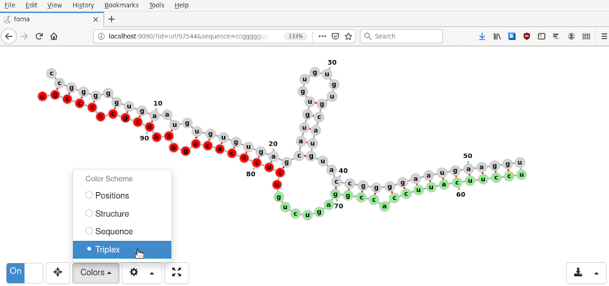

<div id="top"></div>

[](https://quay.io/repository/bagnacan/forna-serve)

# forna-serve

Forna-serve wraps a custom ViennaRNA [forna](https://github.com/ViennaRNA/forna)
web-server, to display and edit RNA triplexes as shown in the [TriplexRNA](https://triplexrna.org)
database.

- [Installation requirements](#installation-requirements)
- [Run forna-serve](#run-forna-serve)
- [Usage](#usage)
  - [URL syntax](#url-syntax)
  - [Example](#example)


## Installation requirements

The only requirement is [Docker](https://www.docker.com/), which can be
installed in different ways depending on the underlying operative system:
- Unix users should follow the [Docker installation for Linux](https://docs.docker.com/engine/install/)
- MacOS 10.13+ users should follow the [Docker installation for Mac](https://docs.docker.com/docker-for-mac/install/)
- Windows 10+ users, should follow the [Docker installation for Windows](https://docs.docker.com/docker-for-windows/install/)
- For legacy systems, users can rely on the [Docker Toolbox](https://docs.docker.com/toolbox/overview/).
<p align="right"><a href="#top">&#x25B2; back to top</a></p>


## Run forna-serve

To run forna-serve, you need to run its docker container. Type:
```
docker run -d -p 9090:8080 quay.io/bagnacan/forna-serve
```

The forna-serve web-service is now listening on your host's port 9090.
You can test its docker container by opening your browser, and type:
```
localhost:9090/ping
```

You should receive a ``pong`` reply. If so, the service is up and running!  
You can now send proper forna queries to visualize and edit RNA triplexes.
<p align="right"><a href="#top">&#x25B2; back to top</a></p>


## Usage

Here we explain the URL syntax that is required for requesting RNA triplex
visualizations, and provide a sample query.
<p align="right"><a href="#top">&#x25B2; back to top</a></p>


### URL syntax

The syntax to visualize RNA molecules is based on the one defined by forna, and
extended to distinguish the different RNAs of a triplex:

1. Host  
If you are running the forna-serve container on your localhost, this will
likely look like ``http://localhost:9090/``

2. Triplex identifier  
A name for the visualized triplex *T*, which must be provided as ``?id=url/T``

3. Sequence  
The full sequence *S* of the complex, to be provided as ``&sequence=S``

4. Structure  
The dot-bracket notation *D* of the complex, to be provided by ``&structure=D``

5. Target gene  
The target gene name *G*, ``&gene=G``

6. 1st miRNA  
The 1st miRNA name *M1*, ``&mirna1=M1``

7. 2nd miRNA  
The 2nd miRNA name *M2*, ``&mirna2=M2``

8. Colors  
The color scheme of the 3 different segments, to be counted in nucleotides.  
Supposing that:
  - *G* should be colored lightgrey, its sequence starts at nt. 1, and ends at nt. *GL*
  - *M1* should be colored lightgreen, its sequence starts at nt. *GL+1* and ends at nt. *M1L*
  - *M2* should be colored red, its sequence starts at nt. *M1L+1* and ends at nt. *M2L*  
The scheme of the triplex *T* will be: ``&colors=>T\n1-GL:lightgrey\nGL+1-M1L:lightgreen\nM1L+1-M2L:red``
<p align="right"><a href="#top">&#x25B2; back to top</a></p>


### Example

Using the aforementioned syntax, we compose a URL to display the RNA triplex [97544](https://triplexrna.org/human/E/E2F1_hsa-miR-205_hsa-miR-342-3p%20%28MFE-50.563%29.png).

The triplex is formed by Human (hg19) target gene [E2F1](https://www.ncbi.nlm.nih.gov/nuccore/NM_005225),
miRNA [hsa-miR-205](http://www.mirbase.org/cgi-bin/mirna_entry.pl?acc=MIMAT0000266),
and miRNA [hsa-miR-342-3p](http://www.mirbase.org/cgi-bin/mirna_entry.pl?acc=MIMAT0000753).  

1. Host  
  ``http://localhost:9090``
2. Triplex identifier  
  ``?id=url/97544``
3. Sequence  
  ```&sequence=ccgggggugaaugugugugagcaugugugugugcauguaccggggaaugaagguuccuucauuccaccggagucugucucacacagaaaucgcacccgu```  
  Where:
    - E2F1 ``ccgggggugaaugugugugagcaugugugugugcauguaccggggaaugaaggu``
    - hsa-miR-205 ``uccuucauuccaccggagucug``
    - hsa-miR-342-3p ``ucucacacagaaaucgcacccgu``
4. Structure  
  ```&structure=.((((.((((.(.(((((((((((((......)))))..((((((((((((((..)))))))))).)))).......))))))))..).)))).)))).```
5. Target gene  
  ``&gene=E2F1``
6. 1st miRNA  
  ``&mirna1=hsa-miR-205``
7. 2nd miRNA  
  ``&mirna2=hsa-miR-342-3p``
8. Colors  
  ``&colors=%3E97544\n1-54:lightgray\n55-76:lightgreen\n77-99:red``  
  Where:
    - E2F1's sequence starts at nt. 1 and ends at nt. 54 (lightgray)
    - hsa-miR-205's sequence starts at nt. 5 and ends at nt. 76 (lightgreen)
    - hsa-miR-342-3p's sequence starts at nt. 77 and ends at nt. 99 (red)

You can now assemble the full URL, and type it in the browser:
```
http://localhost:9090/?id=url/97544&sequence=ccgggggugaaugugugugagcaugugugugugcauguaccggggaaugaagguuccuucauuccaccggagucugucucacacagaaaucgcacccgu&structure=.((((.((((.(.(((((((((((((......)))))..((((((((((((((..)))))))))).)))).......))))))))..).)))).)))).&gene=E2F1&mirna1=hsa-miR-205&mirna2=hsa-miR-342-3p&colors=%3E97544\n1-54:lightgray\n55-76:lightgreen\n77-99:red
```

You will visualize something like this:
<p align="center">
  
</p>
<p align="right"><a href="#top">&#x25B2; back to top</a></p>
